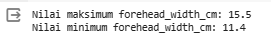
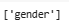
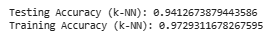
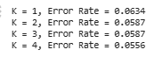

# Laporan Proyek Machine Learning
### Nama : Winda Ayu Melati
### Nim : 211351150
### Kelas : Teknik Informatika - Pagi A


## Domain Proyek
Proyek ini berfokus pada analisis karakteristik wajah untuk memprediksi Gender berdasarkan dataset yang mencakup sejumlah atribut wajah. Data ini terdiri dari variabel-variabel seperti panjang rambut, dimensi dahi, hidung, bibir, dan jarak antara hidung dan bibir.

## Business Understanding
Proyek ini bertujuan untuk membuat aplikasi yang dapat memprediksi gender berdasarkan ciri dan karakteristik wajah. Fokus utamanya adalah mengidentifikasi fitur wajah yang paling relevan dalam memprediksi gender serta membangun model estimasi berdasarkan perilaku pengenalan jenis kelamin dari data wajah yang disediakan.

Bagian laporan ini mencakup:

### Problem Statements
1. Bagaimana fitur-fitur karakteristik wajah, seperti panjang rambut, dimensi dahi, hidung, bibir, dan jarak antara hidung dan bibir, dapat memengaruhi tingkat akurasi dalam prediksi jenis kelamin?

2. Bagaimana cara membuat model prediksi gender yang mampu memberikan prediksi yang akurat dan dapat diandalkan?


### Goals
1. Melakukan analisis mendalam terhadap fitur-fitur karakteristik wajah untuk memahami sejauh mana mereka dapat memberikan kontribusi yang signifikan dalam meningkatkan akurasi prediksi gender.
2. Membantu mempermudah proses prediksi gender sehingga pengguna dapat dengan mudah dan efisien memperoleh hasil prediksi gender.

### Solution statements
1. Analisis data gender untuk memahami faktor-faktor pengaruhnya.
2. Mengidentifikasi dan mengoptimalkan algoritma prediksi guna meningkatkan akurasi model. 
3. Membangun Model prediksi gender berdasarkan dataset yang telah diidentifikasi.
4. Model yang dihasilkan dari dataset akan menggunakan metode  K-Nearest Neighbors (KNN) untuk melakukan prediksi gender.

## Data Understanding
Data yang saya gunakan dalam proyek ini di dapatkan dari Kaggle.com mengenai dataset Memprediksi Gender berdasarkan ciri dan karakteristik wajah. Dan bisa diakses di link berikut :

https://www.kaggle.com/datasets/elakiricoder/gender-classification-dataset

Variabel-variabel pada Dataset Gender Classification adalah sebagai berikut:

- **long_hair (Tipe Data: int64)**: Kolom ini berisi nilai 0 dan 1, di mana 1 menunjukkan "rambut panjang (Yes)" dan 0 menunjukkan "rambut tidak panjang (No)".
- **forehead_width_cm (Tipe Data: float64)**: Kolom ini diukur dalam sentimeter (CM) dan merepresentasikan lebar dahi.
- **forehead_height_cm (Tipe Data: float64)**: Kolom ini diukur dalam sentimeter (CM) dan merepresentasikan ketinggian dahi.
- **nose_wide (Tipe Data: int64)**: Kolom ini berisi nilai 0 dan 1, di mana 1 menunjukkan "hidung lebar (Yes)" dan 0 menunjukkan "hidung tidak lebar (No)".
- **nose_long (Tipe Data: int64)**: Kolom ini berisi nilai 0 dan 1, di mana 1 menunjukkan "hidung panjang (Yes)" dan 0 menunjukkan "hidung tidak panjang (No)".
- **lips_thin (Tipe Data: int64)**: Kolom ini berisi nilai 0 dan 1, di mana 1 menunjukkan "bibir tipis (Yes)" dan 0 menunjukkan "bukan bibir tipis (No)".
- **distance_nose_to_lip_long (Tipe Data: int64)**: Kolom ini berisi nilai 0 dan 1, di mana 1 menunjukkan "jarak jauh antara hidung dan bibir (Yes)" dan 0 menunjukkan "jarak pendek antara hidung dan bibir (No)".
- **gender (Tipe Data: object)**: Kolom ini berisi nilai "Pria" atau "Wanita".

## Data Collection
Untuk data collection ini, saya menggunakan dataset yang didapatkan dari website Kaggle mengenai Memprediksi Gender berdasarkan karakteristik wajah (Gender Classification).

Selanjutnya langsung saja kita ketahap pembuatan model:

### Import Dataset Kaggle
- Langkah pertama kita harus menghubungkan google colab dengan kaggle. kita harus mengimportkan dan mengupload sebuah file yang merupakan token Kaggle agar bisa terhubung dengan kaggle dan agar bisa mendownload sebuah dataset dari kaggle melalui google colab menggunakan script:

```python
from google.colab import files
files.upload()
```

- Langkah selanjutnya yaitu membuat folder untuk menyimpan file kaggle.json yang sudah di upload tadi dan memberikan izin (permission) dengan menggunakan script:

```python
!mkdir -p ~/.kaggle
!cp kaggle.json ~/.kaggle/
!chmod 600 ~/.kaggle/kaggle.json
!ls ~/.kaggle
```

- Langkah selanjutnya memanggil url dataset yang ada di website kaggle untuk didownload langsung ke google colab dengan menggunakan script:

```python
!kaggle datasets download -d elakiricoder/gender-classification-dataset
```

- Selanjutnya kita ekstrak dataset yang sudah didownload menggunakan
script:

```python
!mkdir gender-classification-dataset
!unzip gender-classification-dataset.zip -d gender-classification-dataset
!ls gender-classification-dataset
```

### Import Library Yang Dibutuhkan

- Langkah selanjutnya kita harus mengimport library yang digunakan/dibutuhkan pada studi kasus ini: 

```python
import pandas as pd
import numpy as np
import matplotlib.pyplot as plt
import seaborn as sns
import plotly.express as px
from plotly.subplots import make_subplots
import plotly.graph_objects as go
from plotly.offline import iplot
from sklearn.model_selection import train_test_split
from sklearn.neighbors import KNeighborsClassifier
from sklearn.model_selection import GridSearchCV
from sklearn.metrics import confusion_matrix, classification_report, accuracy_score, roc_auc_score
from sklearn.model_selection import cross_val_score
from sklearn import metrics
from sklearn.metrics import roc_curve, auc
from sklearn.preprocessing import LabelBinarizer
import statistics
```

### Data Discovery
- Langkah selanjutnya memanggil dataset menggunakan perintah:

```python
df = pd.read_csv("gender-classification-dataset/gender_classification_v7.csv")
```
- Selanjutnya kita lihat satu baris acak dari dataset dengan menggunakan kode: 

```python
df.sample()
```


- Selanjutnya kita lihat jumlah baris dan kolom keseluruhan pada data frame menggunakan kode:

```python
df.shape
```
 

Jumlah barisnya yaitu 5001 dan jumlah kolomnya ada 8.

- Selanjutnya kita cek apakah ada data yang duplikat pada data frame dengan menggunakan kode:

```python
overall_duplicates = df[df.duplicated()]
print("Duplikat Keseluruhan:")
print(overall_duplicates)
```


Nah ternyata dalam data frame ada data yang duplikat sebanyak 1768 baris dalam 8 kolom.

- Langkah selanjutnya kita hapus data yang duplikat dan menggantinya ke dalam data frame yang ada menggunakan kode:

```python
# Menghapus duplikat dan mengganti DataFrame yang ada
df.drop_duplicates(inplace=True)
```
- Selanjutnya kita tampilkan data frame setelah menghapus data yang duplikat menggunakan kode:

```python
# Menampilkan DataFrame setelah menghapus duplikat
print("DataFrame setelah menghapus duplikat:")
print(df)
```


Setelah menghapus data yang duplikat sekarang jumlah datanya ada 3233 baris dari 8 kolom.

- Selanjutnya kita mereset indeks dan menghapus indeks yang lama menggunakan kode: 

```python
df = df.reset_index(drop=True)
```
Ini digunakan untuk mereset indeks DataFrame df, menghapus indeks sebelumnya dan menggantinya dengan indeks default yang sesuai dengan urutan baris.

- Selanjutnya kita mengdeskripsikan 5 data paling atas dari dataset menggunakan perintah :

```python
df.head()
```


- Selanjutnya yaitu melihat tipe data dari masing-masing atribut/fitur dari dataset Gender Classification.csv menggunakan perintah property info :

```python
df.info()
```


- Selanjutnya mengecek detail informasi dari dataset gender classification menggunakan perintah :

```python
df.describe()
```


- Selanjutnya kita lihat apakah ada data yang kosong pada data frame menggunakan kode:

```python
df.isnull().sum()
```


tidak ada yang kosong pada data frame.

- Selanjutnya kita lihat jumlah data atau nilai unik dalam kolom 'gender' menggunakan kode:

```python
df['gender'].value_counts()
```


- Selanjutnya kita lihat nilai unik dari kolom lebar dahi atau forehead widht (cm) menggunakan kode:

```python
df['forehead_width_cm'].unique()
```


- Selanjutnya kita lihat nilai maksimum dan minimun dari lebar dahi atau forehead widht (cm) menggunakan kode:

```python
max_value = df['forehead_width_cm'].max()
min_value = df['forehead_width_cm'].min()

print(f'Nilai maksimum forehead_width_cm: {max_value}')
print(f'Nilai minimum forehead_width_cm: {min_value}')
```



- Selanjutnya kita lihat nilai unik dari kolom ketinggian atau panjang dahi atau forehead height (cm) menggunakan kode:

```python
df['forehead_height_cm'].unique()
```


- Selanjutnya kita lihat nilai maksimum dan minimun dari ketinggian atau panjang dahi atau forehead height (cm) menggunakan kode:

```python
max_value = df['forehead_height_cm'].max()
min_value = df['forehead_height_cm'].min()

print(f'Nilai maksimum forehead_height_cm: {max_value}')
print(f'Nilai minimum forehead_height_cm: {min_value}')
```


- Selanjutnya kita lihat jumlah kemunculan setiap nilai unik dalam kolom pertama (indeks 0) dari data frame menggunakan kode:

```python
df.iloc[:,[0]].value_counts()
```


- Selanjutnya kita lihat jumlah kemunculan setiap nilai unik dalam kolom kedua (indeks 1) dari data frame menggunakan kode:

```python
df.iloc[:,[1]].value_counts()
```


- Selanjutnya kita lihat jumlah kemunculan setiap nilai unik dalam kolom ketiga (indeks 2) dari data frame menggunakan kode:

```python
df.iloc[:,[2]].value_counts()
```


- Selanjutnya kita lihat jumlah kemunculan setiap nilai unik dalam kolom keempat (indeks 3) dari data frame menggunakan kode:

```python
df.iloc[:,[3]].value_counts()
```


- Selanjutnya kita lihat jumlah kemunculan setiap nilai unik dalam kolom kelima (indeks 4) dari data frame menggunakan kode:

```python
df.iloc[:,[4]].value_counts()
```


- Selanjutnya kita lihat jumlah kemunculan setiap nilai unik dalam kolom keenam (indeks 5) dari data frame menggunakan kode:

```python
df.iloc[:,[5]].value_counts()
```


- Selanjutnya kita lihat jumlah kemunculan setiap nilai unik dalam kolom ketujuh (indeks 6) dari data frame menggunakan kode:

```python
df.iloc[:,[6]].value_counts()
```


Lanjut saja kita ke langkah selanjutnya karena kolom ke 8 itu gender dan sudah kita liat jumlahnya di awal sebelum melihat jumlah yang lain.

- Selanjutnya kita lihat kemiringan data menggunakan kode :

```python
df.skew()
```
Digunakan untuk menghitung kemiringan (skewness) dari setiap kolom numerik dalam DataFrame df. Kemiringan adalah ukuran statistik yang mengukur sejauh mana distribusi data bersifat simetris.


1. Jika skewness mendekati 0, maka distribusi cenderung simetris.
2. Jika skewness positif, maka ekor distribusi lebih panjang di sisi kanan dan nilai rata-rata lebih besar dari median.
3. Jika skewness negatif, maka ekor distribusi lebih panjang di sisi kiri dan nilai rata-rata lebih kecil dari median.

## EDA (Exploratory Data Analysis)
- Selanjutnya kita buat dan tampilkan  sebuah heatmap dari matriks korelasi antar kolom-kolom numerik dalam DataFrame df. Heatmap memberikan visualisasi yang baik tentang sejauh mana variabel-variabel berkorelasi satu sama lain.

```python
plt.figure(figsize=(10,8))
sns.heatmap(df.corr(),annot=True)
```


Matriks korelasi menunjukkan hubungan antara setiap pasangan variabel. Nilai korelasi berkisar antara -1 hingga 1. Nilai korelasi positif menunjukkan bahwa kedua variabel memiliki hubungan positif, sedangkan nilai korelasi negatif menunjukkan bahwa kedua variabel memiliki hubungan negatif.

- Selanjutanya kita buat gambar plot untuk melihat jumlah dari kolom long hair atau rambut panjang menggunakan Countplot(Bar Plot), dan Pie Chart

```python
colors = px.colors.cyclical.Twilight
fig = make_subplots(rows=1, cols=2,
                    subplot_titles=('Countplot', 'Percentages'),
                    specs=[[{"type": "xy"}, {'type':'domain'}]])

# Bar Plot
fig.add_trace(go.Bar(y=df['long_hair'].value_counts().values.tolist(),
                     x=['1', '0'],
                     text=df['long_hair'].value_counts().values.tolist(),
                     textfont=dict(size=15),
                     textposition='outside',
                     showlegend=False,
                     marker=dict(color=colors, line_color='black', line_width=3),
                     hoverinfo='text'), row=1, col=1)

# Pie Chart
fig.add_trace(go.Pie(labels=['Long Hair', 'Not Long Hair'],
                     values=df['long_hair'].value_counts().values,
                     textfont=dict(size=16),
                     hole=0.4,
                     marker=dict(colors=colors),
                     textinfo='label+percent',
                     hoverinfo='label'), row=1, col=2)

fig.update_yaxes(range=[0, 800])

# Mengubah latar belakang plot dan figure
fig.update_layout(
    paper_bgcolor='#FFFDE7',
    plot_bgcolor='#FFFDE7',
    title=dict(text="Long Hair Distribution", x=0.5, y=0.95),
    title_font_size=30
)

# Mengganti label pada sumbu x
fig.update_xaxes(title_text="Long Hair", ticktext=['Not Long Hair', 'Long Hair'], tickvals=[0, 1], row=1, col=1)

# Menampilkan plot
iplot(fig)
```

Kode ini digunakan untuk membuat subplot dengan dua bagian:

1. Countplot:
    - Bar plot yang menunjukkan distribusi jumlah nilai 'long_hair' dalam DataFrame df.
    - Menggunakan warna siklus "Twilight" dari plotly express.
    - Mempresentasikan jumlah 'Long Hair' dan 'Not Long Hair' dalam bentuk batang.

2. Pie Chart:
    - Diagram lingkaran (pie chart) yang memvisualisasikan persentase 'Long Hair' dan 'Not Long Hair' dalam DataFrame df.
    - Menggunakan warna siklus "Twilight" dari plotly express.
    - Menampilkan persentase dengan informasi label di dalam pie chart.


- Selanjutnya kita buat gambar plot untuk melihat jumlah dari wide nose atau hidung lebar dari kolom  menggunakan Countplot(Bar Plot), dan Pie Chart

```python
colors = px.colors.cyclical.Twilight
fig = make_subplots(rows=1, cols=2,
                    subplot_titles=('Countplot', 'Percentages'),
                    specs=[[{"type": "xy"}, {'type':'domain'}]])

# Bar Plot
fig.add_trace(go.Bar(y=df['nose_wide'].value_counts().values.tolist(),
                     x=['0', '1'],
                     text=df['nose_wide'].value_counts().values.tolist(),
                     textfont=dict(size=15),
                     textposition='outside',
                     showlegend=False,
                     marker=dict(color=colors, line_color='black', line_width=3),
                     hoverinfo='text'), row=1, col=1)

# Pie Chart
fig.add_trace(go.Pie(labels=['Not wide nose', 'Wide nose'],
                     values=df['nose_wide'].value_counts().values,
                     textfont=dict(size=16),
                     hole=0.4,
                     marker=dict(colors=colors),
                     textinfo='label+percent',
                     hoverinfo='label'), row=1, col=2)

fig.update_yaxes(range=[0, 800])

# Mengubah latar belakang plot dan figure
fig.update_layout(
    paper_bgcolor='#FFFDE7',
    plot_bgcolor='#FFFDE7',
    title=dict(text="Wide Nose Distribution", x=0.5, y=0.95),
    title_font_size=30,
    height=400,  # Sesuaikan dengan ukuran yang diinginkan
    width=800    # Sesuaikan dengan ukuran yang diinginkan
)

# Mengganti label pada sumbu x
fig.update_xaxes(title_text="Wide Nose", ticktext=['Not Wide Nose', 'Wide Nose'], tickvals=[0, 1], row=1, col=1)

# Menampilkan plot
iplot(fig)
```
Kode ini digunakan untuk membuat subplot dengan dua bagian:

1. Countplot:
    - Bar plot yang menunjukkan distribusi jumlah nilai 'nose_wide' dalam DataFrame df.
    - Menggunakan warna siklus "Twilight" dari plotly express.
    - Mempresentasikan jumlah 'Wide Nose' dan 'Not Wide Nose' dalam bentuk batang.

2. Pie Chart:
    - Diagram lingkaran (pie chart) yang memvisualisasikan persentase 'Wide Nose' dan 'Not Wide Nose' dalam DataFrame df.
    - Menggunakan warna siklus "Twilight" dari plotly express.
    - Menampilkan persentase dengan informasi label di dalam pie chart.


- Selanjutnya kita buat gambar plot untuk melihat jumlah dari gender menggunakan Countplot(Bar Plot), dan Pie Chart

```python
colors = px.colors.cyclical.Twilight
fig = make_subplots(rows=1, cols=2,
                    subplot_titles=('Countplot', 'Percentages'),
                    specs=[[{"type": "xy"}, {'type':'domain'}]])

# Bar Plot
fig.add_trace(go.Bar(y=df['gender'].value_counts().values.tolist(),
                     x=['Female', 'Male'],
                     text=df['gender'].value_counts().values.tolist(),
                     textfont=dict(size=15),
                     textposition='outside',
                     showlegend=False,
                     marker=dict(color=colors, line_color='black', line_width=3),
                     hoverinfo='text'), row=1, col=1)

# Pie Chart
fig.add_trace(go.Pie(labels=['Female','Male'],
                     values=df['gender'].value_counts().values,
                     textfont=dict(size=16),
                     hole=0.4,
                     marker=dict(colors=colors),
                     textinfo='label+percent',
                     hoverinfo='label'), row=1, col=2)

fig.update_yaxes(range=[0, 600])

# Mengubah latar belakang plot dan figure
fig.update_layout(
    paper_bgcolor='#FFFDE7',
    plot_bgcolor='#FFFDE7',
    title=dict(text="Gender Distribution", x=0.5, y=0.95),
    title_font_size=30,
    height=400,  # Sesuaikan dengan ukuran yang diinginkan
    width=800    # Sesuaikan dengan ukuran yang diinginkan
)

# Mengganti label pada sumbu x bar plot
fig.update_xaxes(title_text="Gender", ticktext=['Female','Male'], tickvals=[0, 1, 2], row=1, col=1)

# Menampilkan plot
iplot(fig)
```
Kode ini digunakan untuk membuat subplot dengan dua bagian:

1. Countplot (Bar Plot):
    - Bar plot yang menunjukkan distribusi jumlah nilai 'gender' dalam DataFrame df.
    - Menggunakan warna siklus "Twilight" dari plotly express.
    - Mempresentasikan jumlah 'Female' dan 'Male' dalam bentuk batang.

2. Pie Chart:
    - Diagram lingkaran (pie chart) yang memvisualisasikan persentase 'Female' dan 'Male' dalam DataFrame df.
    - Menggunakan warna siklus "Twilight" dari plotly express.
    - Menampilkan persentase dengan informasi label di dalam pie chart.


- Selanjutnya kita membuat subplot dengan dua bagian, yang masing-masing menampilkan distribusi variabel numerik dalam DataFrame df

```python
fig, axes = plt.subplots(1, 2, figsize=(10, 6))

# Plot Forehead Width Distribution
sns.histplot(df['forehead_width_cm'], kde=True, ax=axes[0], color='gold')
axes[0].set_title('Forehead Width Distribution')

# Plot Forehead Height Distribution
sns.histplot(df['forehead_height_cm'], kde=True, ax=axes[1], color='lightcoral')
axes[1].set_title('Forehead Height Distribution')

plt.tight_layout()
plt.show()
```
1. Subplot Pertama (axes[0]):
    - Menampilkan distribusi lebar dahi (forehead_width_cm) dengan menggunakan histogram dan kurva kepadatan (kernel density estimate - kde).
    - Warna plot ditentukan sebagai 'gold'.
    - Judul subplot ditetapkan sebagai 'Forehead Width Distribution'.

2. Subplot Kedua (axes[1]):
    - Menampilkan distribusi tinggi dahi (forehead_height_cm) dengan menggunakan histogram dan kurva kepadatan (kde).
    - Warna plot ditentukan sebagai 'lightcoral'.
    - Judul subplot ditetapkan sebagai 'Forehead Height Distribution'.


- Selanjutnya kita membuat subplot dengan dua bagian, yang masing-masing menampilkan distribusi variabel biner (0 atau 1) dalam DataFrame df.

```python
fig, axes = plt.subplots(1, 2, figsize=(10, 5))

# Plot Nose Long Distribution
sns.countplot(x='nose_long', data=df, ax=axes[0], palette='pastel')
axes[0].set_title('Nose Long Distribution')

# Plot Lips Thin Distribution
sns.countplot(x='lips_thin', data=df, ax=axes[1], palette='pastel')
axes[1].set_title('Lips Thin Distribution')

plt.tight_layout()
plt.show()
```
1. Subplot Pertama (axes[0]):
    - Menampilkan distribusi variabel 'nose_long' (0 atau 1), 0 (No) dan 1 (Yes) menggunakan countplot.
    - Warna plot ditentukan sebagai palet 'pastel'.
    - Judul subplot ditetapkan sebagai 'Nose Long Distribution'.


2. Subplot Kedua (axes[1]):
    - Menampilkan distribusi variabel 'lips_thin' (0 atau 1), 0 (No) dan 1 (Yes) menggunakan countplot.
    - Warna plot ditentukan sebagai palet 'pastel'.
    - Judul subplot ditetapkan sebagai 'Lips Thin Distribution'.


- Selanjutnya membuat diagram batang (bar plot) yang membandingkan hubungan antara variabel 'gender' dan 'lips_thin' dalam DataFrame df.

```python
plt.figure(figsize=(7,5))
sns.barplot(x='gender',y='lips_thin',data=df, palette=['skyblue', 'mistyrose'])
plt.title('Gender vs Lips Thin')
plt.xlabel('Gender')
plt.ylabel('Lips Thin')
plt.show()
```

1. Sumbu X (x='gender'): Menunjukkan kategori 'gender' (Pria atau Wanita).
2. Sumbu Y (y='lips_thin'): Menunjukkan nilai 'lips_thin' (0 atau 1), yang mengindikasikan apakah bibir tipis atau tidak tipis.
3. Palette (palette=['skyblue', 'mistyrose']): Memberikan warna batang berbeda untuk setiap kategori gender (skyblue untuk Pria, mistyrose untuk Wanita).


- Selanjutnya kita membuat diagram batang (bar plot) yang membandingkan hubungan antara variabel 'gender' dan 'forehead_width_cm' dalam DataFrame df.

```python
plt.figure(figsize=(7,5))
sns.barplot(x='gender',y='forehead_width_cm',data=df, palette=['skyblue', 'mistyrose'])
plt.title('Gender vs Widht Fore Head')
plt.xlabel('Gender')
plt.ylabel('Widht Fore Head')
plt.show()
```
1. Sumbu X (x='gender'): Menunjukkan kategori 'gender' (Pria atau Wanita).
2. Sumbu Y (y='forehead_width_cm'): Menunjukkan nilai 'forehead_width_cm', yang mengindikasikan lebar dahi dalam sentimeter.
3. Palette (palette=['skyblue', 'mistyrose']): Memberikan warna batang berbeda untuk setiap kategori gender (skyblue untuk Pria, mistyrose untuk Wanita).


## Data Preparation
Selanjutnya kita lanjut ke data preparation :
- Selanjutnya mengelompokkan kolom-kolom dalam DataFrame df menjadi dua kategori berdasarkan jenis datanya: numerik (numerical) dan kategorikal (categorical). Selanjutnya, dilakukan pengisian nilai yang hilang (missing values) untuk setiap kolom.

```python
numerical = []
catgcols = []

for col in df.columns:
    if df[col].dtype == "float64" or df[col].dtype == "int64":
        numerical.append(col)
    else:
        catgcols.append(col)

for col in df.columns:
    if col in numerical:
        df[col].fillna(df[col].median(), inplace=True)
    else:
        df[col].fillna(df[col].mode()[0], inplace=True)
```
- Selanjutnya kita lihat data apa aja yang numerical:

```python
numerical
```


- Selanjutnya kita lihat data apa aja yang categoricals:

```python
 catgcols
```


- Selanjutnya mendefinisikan dua kelompok variabel dalam DataFrame df:

```python
 ind_col = [col for col in df.columns if col != 'gender']
dep_col = 'gender'
```
Variabel ind_col menyimpan nama kolom-kolom yang digunakan sebagai fitur atau variabel independen, sedangkan dep_col menyimpan nama kolom yang digunakan sebagai target atau variabel dependen dalam analisis atau pemodelan.

- Selanjutnya kita lihat lagi jumlah data menggunakan:

```python
 df.shape
```


- Selanjutnya membagi dataset menjadi dua bagian yaitu x semua kolom target selain gender dan y kolom gender atau target :

```python
x = df.drop(columns='gender', axis=1)
y = df['gender']
```
- Selanjutnya kita print variabel x:

```python
print(x)
```


- Selanjutnya kita print variabel y:

```python
print(y)
```


- Langkah selanjutnya yaitu melakukan seleksi fitur dengan memisahkan mana saja atribut yang akan dijadikan sebagai fitur dan atribut mana saja yang akan dijadikan label seperti berikut :

```python
features = ['long_hair', 'forehead_width_cm', 'forehead_height_cm', 'nose_wide',	'nose_long', 'lips_thin', 'distance_nose_to_lip_long']
x = df[features]
y = df['gender']
print(x.shape)
print(y.shape)
```


##Modeling
Selanjutnya kita lanjut ke Modelling

- Selanjutnya yaitu melakukan split data, yaitu memisahkan data training dan data testing dengan script seperti berikut:

```python
x_train, x_test, y_train, y_test = train_test_split(x, y,test_size=0.2, random_state=42)
y_test.shape
x_train.shape
```


- Tahap selanjutnya yaitu membuat Model KNeighborsClassifier (KNN) dan memasukan data training dan testing ke dalam model KNeighborsClassifier(KNN):

```python
model=KNeighborsClassifier(n_neighbors=3)
model.fit(x_train,y_train)
y_pred=model.predict(x_test)
```

- Selanjutnya print akurasi dari testing dan training:

```python
# Print accuracy for the testing set
test_score = model.score(x_test, y_test)
print('Testing Accuracy (k-NN):', test_score)

# Print accuracy for the training set
train_score = model.score(x_train, y_train)
print('Training Accuracy (k-NN):', train_score)
```



- Selanjutnya kita tentukan best parameter dan best score menggunakan: 

```python
param_grid = {'n_neighbors':np.arange(1,5)}
knn = KNeighborsClassifier()
knn_cv= GridSearchCV(knn,param_grid,cv=5)
knn_cv.fit(x,y)

print("Best Score:" + str(knn_cv.best_score_))
print("Best Parameters: " + str(knn_cv.best_params_))
```


### Simulai Data
```python
input_data = np.array([[1, 11.8, 6.1, 1, 0, 1, 1]])
prediction = model.predict(input_data)
print('Prediksi Gender = ', prediction)
```


## Evaluation
- Membuat dan Melatih Model KNN:

```python
knn = KNeighborsClassifier(n_neighbors=3)
knn.fit(x_train, y_train)
```

- Memprediksi dan Mengevaluasi Model:

Tabel silang  (cross-tabulation) antara nilai aktual (y_test) dan nilai yang diprediksi (y_pred) pada model.

```python
pd.crosstab(y_test, y_pred, rownames=['True'], colnames=['gender'], margins=True, margins_name="Total")
```


**1. Menggunakan Confusion Matrix:**

Confusion Matrix adalah sebuah matriks yang digunakan untuk mengevaluasi kinerja dari suatu sistem klasifikasi. Matriks ini membandingkan hasil klasifikasi model dengan nilai sebenarnya dari data yang diuji.

Berikut adalah komponen-komponen utama dari Confusion Matrix:

- True Positive (TP):
    Jumlah observasi yang benar-benar positif dan diklasifikasikan sebagai positif oleh model.

- True Negative (TN):
    Jumlah observasi yang benar-benar negatif dan diklasifikasikan sebagai negatif oleh model.

- False Positive (FP):
    Jumlah observasi yang sebenarnya negatif, tetapi salah diklasifikasikan sebagai positif oleh model (kesalahan Type I).

- False Negative (FN):
    Jumlah observasi yang sebenarnya positif, tetapi salah diklasifikasikan sebagai negatif oleh model (kesalahan Type II).
        
    

Ini merupakan Hasil Confussion Matrix dari Prediksi Gender Mengunakan KNN. 
Kita bisa membuatnya menggunakan kode:

```python
print(confusion_matrix(y_test, y_pred))
```


**2. Classification Report**
Dengan menggunakan informasi dari Confusion Matrix, kita dapat menghitung berbagai metrik evaluasi seperti Akurasi, Presisi, Recall, dan F1 Score untuk mengevaluasi kinerja model klasifikasi.


Ini merupakan Classification Report dari studi kasus ini, kita bisa membuatnya juga dengan menggunakan kode:

```python
print(classification_report(y_test, y_pred))
```


Classification Report memberikan informasi evaluasi klasifikasi untuk setiap kelas yang ada dalam dataset. Hal ini sangat berguna ketika data tidak seimbang (imbalanced), di mana jumlah observasi dalam setiap kelas bisa berbeda. Dengan melihat metrik untuk setiap kelas, kita dapat mengetahui kelas mana yang mungkin memiliki performa yang lebih rendah dan memerlukan perhatian khusus.

Classification Report menyajikan metrik-metrik seperti Presisi, Recall, dan F1 Score yang memberikan informasi tentang trade-off antara True Positive, False Positive, dan False Negative. Misalnya, Presisi memberikan informasi tentang seberapa akurat model dalam mengklasifikasikan positif, sedangkan Recall memberikan informasi tentang seberapa baik model dalam menangkap semua instance positif yang sebenarnya.

**3. Cv scores**
Cross-validation (CV) scores adalah elemen penting dalam evaluasi model, membantu memastikan bahwa performa model dapat diukur dengan lebih reliabel. Proses ini melibatkan beberapa langkah:

- **Pembagian Data:**
Data dibagi menjadi beberapa subset yang disebut lipatan atau "folds." Proses ini memastikan bahwa setiap bagian data digunakan baik sebagai data pelatihan maupun data pengujian.

- **Pelatihan dan Pengujian Model:**
Model dilatih menggunakan beberapa kombinasi lipatan sebagai data pelatihan dan diuji pada lipatan yang tersisa sebagai data pengujian. Proses ini diulangi sejumlah lipatan, dan skor kinerja dicatat pada setiap iterasi.

 - **CV Scores:**
 CV scores adalah hasil dari metrik evaluasi model pada setiap lipatan. Biasanya, ini mencakup akurasi, presisi, recall, F1-score, atau metrik evaluasi lainnya yang relevan dengan jenis masalah yang dihadapi.

- **Agregasi Skor:**
 CV scores dari setiap lipatan dapat diambil rata-rata atau agregasi lainnya untuk memberikan skor kinerja akhir model. Ini membantu mengurangi variabilitas dan memberikan gambaran yang lebih konsisten tentang kemampuan model untuk melakukan generalisasi pada data baru.

Pentingnya CV scores dalam evaluasi model terletak pada kemampuannya untuk memberikan ukuran kinerja yang lebih konsisten dan dapat dipercaya. Proses ini membantu dalam pemilihan model yang stabil dan menilai seberapa baik model dapat menangani variasi dalam data. Meskipun CV scores memberikan wawasan yang kuat, evaluasi akhir sering melibatkan uji pada set data pengujian yang terpisah untuk memastikan bahwa model dapat berkinerja dengan baik pada data yang belum pernah dilihat sebelumnya.

Berikut Cv scores dari model ini, kita bisa membuatnya dengan menggunkan kode:

```python
cv_scores = cross_val_score(knn, x, y, cv=5)
print(cv_scores)
print("\nAverage 5-Fold Score: {}".format(np.mean(cv_scores)))
```


**4. ROC AUC Score dan Accuracy Score**

- **ROC AUC Score:**

ROC AUC (Receiver Operating Characteristic Area Under the Curve) adalah metrik yang mengukur seberapa baik model mampu membedakan antara kelas positif dan negatif. Semakin tinggi nilai ROC AUC, semakin baik model dalam memisahkan kelas-kelas tersebut. Dalam konteks ini, kode menghitung dan mencetak ROC AUC Score untuk model K-Nearest Neighbors.

ROC AUC Score dihitung dari kurva ROC, yang mengukur performa model dalam membedakan antara kelas positif dan negatif.
 
Rumusnya adalah:


Di sini, ROC curve adalah kurva yang menggambarkan hubungan antara True Positive Rate (TPR atau Recall) dan False Positive Rate (FPR). 


- **Accuracy Score:**

Accuracy Score mengukur seberapa akurat model dalam memprediksi kelas target. Ini adalah rasio antara jumlah prediksi yang benar dengan total jumlah prediksi. Dalam konteks ini, kode menghitung dan mencetak Accuracy Score untuk model K-Nearest Neighbors.

Namun, penting untuk dicatat bahwa evaluasi ini mungkin bukan evaluasi akhir yang menyeluruh.

Accuracy Score dihitung dengan rumus sederhana sebagai rasio antara prediksi yang benar (True Positives + True Negatives) dengan total jumlah prediksi (semua empat elemen matriks kebingungan). 
Rumusnya adalah:


Accuracy memberikan gambaran tentang seberapa akurat model dalam memprediksi seluruh kelas.

Berikut merupakan ROC dan Akurasi dari Studi Kasus ini, kita bisa membuatnya menggunakan kode:

```python
y_pred_proba=knn.predict_proba(x_test)[:,1]

print("\n ROC AUC Score knn : {}".format(roc_auc_score(y_test, y_pred_proba)))
print("\n accuracy score : {}".format(accuracy_score(y_test,y_pred)))
```


**5. Error Rate**

Error Rate adalah metrik evaluasi yang menggambarkan persentase dari keseluruhan prediksi yang salah yang dilakukan oleh model. Metrik ini dihitung dengan membagi jumlah prediksi yang salah dengan total jumlah prediksi. Meskipun kurang umum digunakan dibandingkan dengan metrik seperti akurasi, presisi, recall, dan F1-score, Error Rate memiliki beberapa kegunaan dan relevansi:

 **1. Menyajikan Perspektif Kesalahan:**
    Error Rate memberikan gambaran tentang seberapa sering model melakukan kesalahan. Seberapa besar persentase dari seluruh prediksi yang keliru dapat membantu pemahaman tentang seberapa baik model dapat menangani kasus yang kompleks atau langka.

 **2.Komplementer dengan Akurasi:**
    Meskipun akurasi memberikan informasi tentang seberapa baik model dapat memprediksi dengan benar, Error Rate memberikan perspektif sebaliknya. Dengan melihat keduanya bersama-sama, kita dapat memiliki pemahaman yang lebih lengkap tentang performa model.

**3. Relevan pada Kasus Ketidakseimbangan Kelas:**
   Pada kasus di mana kelas-kelas dalam data tidak seimbang (imbalance), akurasi dapat menjadi tidak informatif. Error Rate dapat memberikan wawasan tambahan karena fokus pada kesalahan yang dilakukan oleh model pada kelas-kelas yang kurang banyak.

**Rumus Error Rate sederhana dan dapat dihitung sebagai berikut:**


Di mana:
- "Jumlah Prediksi Salah" adalah jumlah prediksi yang tidak benar oleh model.
- "Total Jumlah Prediksi" adalah jumlah total prediksi yang dilakukan oleh model.

Error Rate memberikan persentase kesalahan relatif terhadap seluruh prediksi. Semakin rendah nilai Error Rate, semakin baik performa model, karena menunjukkan bahwa model memiliki lebih sedikit kesalahan prediksi relatif terhadap total prediksi yang dilakukan.


Hasil evaluasi termasuk matriks kebingungan, laporan klasifikasi, skor validasi silang, skor ROC AUC, dan skor akurasi. Metrik-metrik ini memberikan gambaran tentang seberapa baik model KNN dapat melakukan prediksi pada data uji (x_test dan y_test).

## Visualisasi Hasil Modeling dan Evaluation

- Visualisasi Confusion Matriks:

```python
y_pred = knn.predict(x_test)
cnf_matrix = metrics.confusion_matrix(y_test, y_pred)
p = sns.heatmap(pd.DataFrame(cnf_matrix), annot=True, cmap="YlGnBu" ,fmt='g')
plt.title('Confusion matrix KNN', y=1.1)
plt.ylabel('Actual label')
plt.xlabel('Predicted label')
```


- Visualisasi KNN Akurasi (Testing Accuracy & Training Accuracy) / KNN Varying Number of neighbors dengan arange (1-5):

```python
#Setup arrays to store training and test accuracies
neighbors = np.arange(1,5)
train_accuracy =np.empty(len(neighbors))
test_accuracy = np.empty(len(neighbors))

for i,k in enumerate(neighbors):
    #Setup a knn classifier with k neighbors
    knn = KNeighborsClassifier(n_neighbors=k)

    #Fit the model
    knn.fit(x_train, y_train)

    #Compute accuracy on the training set
    train_accuracy[i] = knn.score(x_train, y_train)

    #Compute accuracy on the test set
    test_accuracy[i] = knn.score(x_test, y_test)
```

Menampilkan Hasil Plot Akurasi
```python
plt.title('k-NN Varying number of neighbors')
plt.plot(neighbors, test_accuracy, label='Testing Accuracy')
plt.plot(neighbors, train_accuracy, label='Training accuracy')
plt.legend()
plt.xlabel('Number of neighbors')
plt.ylabel('Accuracy')

# Annotate each point with its corresponding k value
for neighbor, test_acc, train_acc in zip(neighbors, test_accuracy, train_accuracy):
    plt.text(neighbor, test_acc, f'k={neighbor}', ha='right', va='bottom')
    plt.text(neighbor, train_acc, f'k={neighbor}', ha='right', va='top')

# Add scatter points for emphasis
plt.scatter(neighbors, test_accuracy, color='red', marker='o', label='Testing Accuracy')
plt.scatter(neighbors, train_accuracy, color='blue', marker='x', label='Training Accuracy')

plt.legend()
plt.show()

# Print the accuracy values
for neighbor, test_acc, train_acc in zip(neighbors, test_accuracy, train_accuracy):
    print(f"Neighbors: {neighbor}, Testing Accuracy: {test_acc:.4f}, Training Accuracy: {train_acc:.4f}")
```


- Selanjutnya Visualisasi Akurasi performa model K-Nearest Neighbors (KNN) untuk berbagai nilai k (jumlah tetangga terdekat).

Grafik ini menunjukkan akurasi model KNN untuk setiap nilai k dalam rentang 1 hingga 4


```python
score_list = []
for k in range(1, 5):
    knn = KNeighborsClassifier(n_neighbors=k)
    knn.fit(x_train, y_train)
    score = knn.score(x_test, y_test)
    score_list.append(score)
    print(f"K = {k}, Accuracy = {score:.4f}")

# Plot the accuracy for different k values
plt.plot(range(1, 5), score_list, marker='o', linestyle='-', color='b', label='Accuracy')
plt.scatter(range(1, 5), score_list, color='red')  # Add red points for emphasis
plt.xlabel("k values")
plt.ylabel("Accuracy")
plt.title("Accuracy for Different k Values")

# Annotate each point with its corresponding k value
for k, score in zip(range(1, 5), score_list):
    plt.text(k, score, f'k={k}', ha='right', va='bottom')

plt.legend()
plt.show()
```


- Selanjutnya Visualisasi untuk Error Rate

Menghitung tingkat kesalahan (error rate) dari model K-Nearest Neighbors (KNN) untuk berbagai nilai k (jumlah tetangga terdekat).
```python
error_rate= []
for i in range(1, 5):
    knn = KNeighborsClassifier(n_neighbors = i)
    knn.fit(x_train,y_train)
    pred_i = knn.predict(x_test)
    error_rate.append(np.mean(pred_i != y_test))
```
Kode ini untuk memprint hasil dari error rate
```python
for k, error in zip(range(1, 5), error_rate):
    print(f"K = {k}, Error Rate = {error:.4f}")

plt.show()
```


Menampilkan Plot Error Rate vs K

```python
plt.figure(figsize = (8,6))
plt.plot(range(1,5),error_rate,color = 'blue',linestyle = '--',marker = 'o',markerfacecolor='red',markersize = 10)
plt.title('Error Rate vs K')
plt.xlabel('K')
plt.ylabel('Error Rate')
```


- Selanjutnya Visualisasi Receiver Operating Characteristic (ROC):

 ```python
# Convert categorical labels to binary format
label_binarizer = LabelBinarizer()
y_train_bin = label_binarizer.fit_transform(y_train)
y_test_bin = label_binarizer.transform(y_test)

# Create and train the KNN model for k=8
k_value = 3
knn = KNeighborsClassifier(n_neighbors=k_value)
knn.fit(x_train, y_train_bin)

# Make predictions on the testing set
y_pred_proba = knn.predict_proba(x_test)[:, 1]

# Calculate ROC curve
fpr, tpr, thresholds = roc_curve(y_test_bin, y_pred_proba)
roc_auc = auc(fpr, tpr)

# Plot ROC curve for k=3
plt.figure(figsize=(5, 5))
plt.plot(fpr, tpr, color='darkorange', lw=2, label='ROC curve (area = {:.2f})'.format(roc_auc))
plt.plot([0, 1], [0, 1], color='navy', lw=2, linestyle='--')
plt.xlim([0.0, 1.0])
plt.ylim([0.0, 1.05])
plt.xlabel('False Positive Rate')
plt.ylabel('True Positive Rate')
plt.title('Receiver Operating Characteristic (ROC) for k=3')
plt.legend(loc="lower right")
plt.show()

# Print AUC value for k=8
print(f"AUC for k=3: {roc_auc:.4f}")
```

Blok kode tersebut digunakan untuk membuat dan mengevaluasi kurva Receiver Operating Characteristic (ROC) untuk model K-Nearest Neighbors (KNN) dengan nilai `k=3`. Berikut adalah penjelasan singkatnya:

**1. Konversi Label Categorical ke Format Biner:**
   - Menggunakan `LabelBinarizer` untuk mengubah label kategori menjadi format biner.
   - `y_train_bin` dan `y_test_bin` menjadi representasi biner dari label pelatihan dan uji.

**2. Pelatihan Model KNN:**
   - Membuat model KNN dengan jumlah tetangga (`k_value`) sebanyak 3.
   - Melatih model menggunakan data pelatihan (`x_train` dan `y_train_bin`).

**3. Prediksi Probabilitas dan Perhitungan ROC Curve:**
   - Memprediksi probabilitas kelas positif untuk data uji (`x_test`) menggunakan model KNN.
   - Menghitung nilai False Positive Rate (FPR), True Positive Rate (TPR), dan ambang batas (thresholds) untuk membuat kurva ROC.
   - Menghitung luas area di bawah kurva ROC (AUC) untuk mengevaluasi kinerja model.

**4. Plotting ROC Curve:**
   - Membuat plot ROC curve dengan nilai AUC yang ditampilkan di grafik.
   - Garis putus-putus merepresentasikan performa model yang memprediksi secara acak.

**5. Menampilkan AUC:**
   - Mencetak nilai AUC untuk model KNN dengan `k=3`.

Analisis ROC curve dan AUC membantu mengukur sejauh mana model KNN dapat membedakan antara kelas positif dan negatif. Semakin tinggi nilai AUC, semakin baik model dalam memprediksi kelas positif.


- Selanjutnya Visualisasi algoritma K-Nearest Neighbors (KNN) dengan parameter k tertentu. 

 ```python
def knn_algorithm(k, x1, x2):
    euclidean_distance = []

    for i in range(df.shape[0]):
        euclidean_distance.append(np.sqrt(np.dot(df.iloc[i].values[:2] - [x1, x2], df.iloc[i].values[:2] - [x1, x2])))

    index = np.argsort(euclidean_distance)
    index = index[:k]
    label = [df.gender[i] for i in index]
    label = statistics.mode(label)

    palette = sns.color_palette("husl", 2)
    colors = {0: palette[0], 1: palette[1]}

    fig = plt.figure(figsize=(15, 8))
    sns.scatterplot(data=df, x='forehead_height_cm', y='forehead_width_cm', hue='gender',
                    alpha=0.9, s=250, palette=palette)

    for i in index:
        target_value = df.iloc[i].values[-1]
        if isinstance(target_value, (int, float)):  # Check if the target value is numeric
            color = colors[target_value]
        else:
            color = 'gray'  # Assign a specific color for non-numeric values
        plt.scatter(x=df['forehead_height_cm'][i], y=df['forehead_width_cm'][i], s=250, alpha=0.6, linewidth=2, edgecolor='k', color=color)

    plt.scatter(x=x1, y=x2, s=400, marker='*', color='k')
    plt.title(label=f'K-Nearest Neighbor with K = {k}', fontsize=14)
    ax = fig.get_axes()[0]
    ax.set_axis_off()
    plt.show()

    return f'Predictions: {label}'

k_value = 3
x1_value = 6.1
x2_value = 14.9

result = knn_algorithm(k_value, x1_value, x2_value)
print(result)
```
Fungsi `knn_algorithm` di atas digunakan untuk mengilustrasikan algoritma K-Nearest Neighbors (KNN) dengan parameter k tertentu pada dataset karakteristik wajah. Berikut adalah penjelasan singkat hasil eksekusi kode di atas:

**1. Perhitungan Jarak Euclidean:**
   - Menghitung jarak Euclidean antara titik yang akan diprediksi (`[x1, x2]`) dan setiap titik dalam dataset menggunakan rumus Euclidean.

**2. Pemilihan K Tetangga Terdekat:**
   - Mengurutkan jarak Euclidean dan memilih k tetangga terdekat.

**3. Prediksi Kelas:**
   - Mengambil label kelas dari tetangga terdekat.
   - Jika kelas bersifat numerik, memetakan warna sesuai dengan kelas; jika tidak, menggunakan warna abu-abu.

**4. Visualisasi Scatter Plot:**
   - Membuat scatter plot dengan warna berdasarkan label kelas pada dataset.
   - Menyorot titik-titik tetangga terdekat dengan ukuran yang lebih besar dan warna yang berbeda.
   - Titik yang akan diprediksi ditandai dengan bintang (*).

**5. Menampilkan Hasil Prediksi:**
   - Menampilkan hasil prediksi kelas pada console.

Dengan memanggil fungsi `knn_algorithm` dengan nilai k tertentu dan koordinat titik prediksi (`x1_value`, `x2_value`), kita dapat melihat visualisasi serta hasil prediksi kelas dari algoritma KNN pada dataset karakteristik wajah.


## Simpan Model
Langkah Terakhir yaitu kita Simpan Model jangan lupa untuk menyimpan model seperti berikut:


- Simpan Model Pickle
```python
import pickle

filename = 'GenderPrediction.sav'
pickle.dump(knn,open(filename,'wb'))
```
- Simpan CSV
```python
df.to_csv('GenderPrediction.csv',index=False)
```


## Deployment

gender-prediction.streamlit.app


